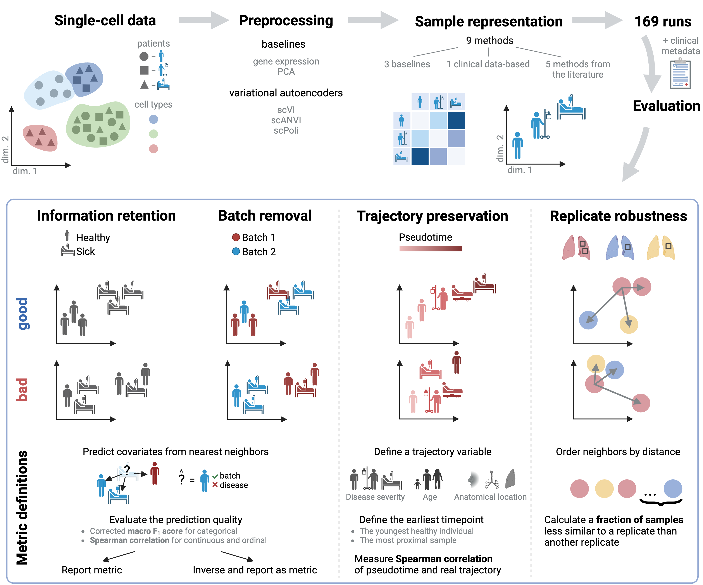
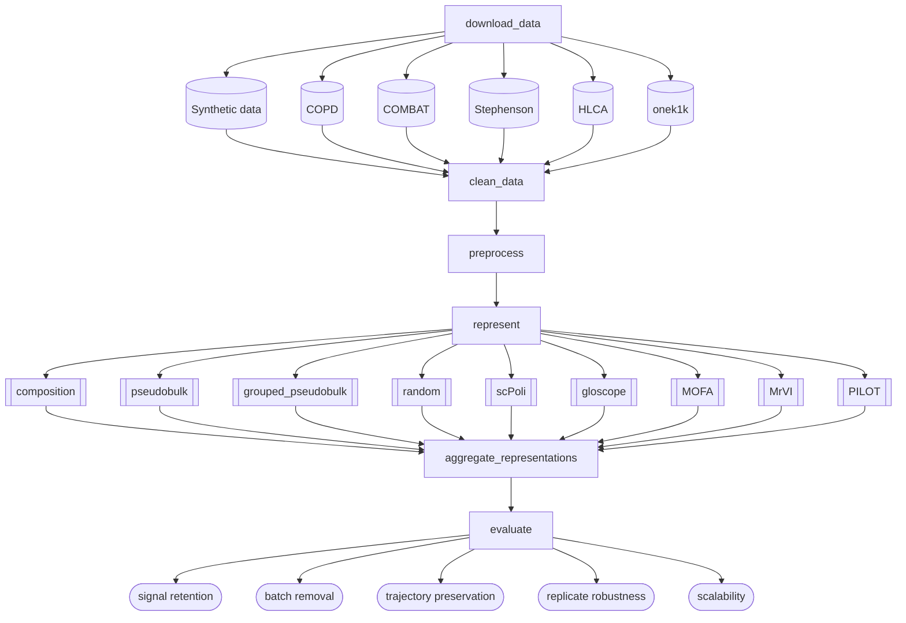

# SPARE Benchmark for Sample Representation from Single-Cell Data

As single-cell datasets are growing, it is becoming possible to analyse differences between groups of samples on a cellular and molecular level. The promise of patient stratification, disease classification, and early-stage diagnosis has led to the development of several so-called sample representation methods. However, consistent standards for the evaluation of sample representation methods are lacking. We developed SPARE – a modular and extendable sample representation benchmark, defining 3 application-inspired metrics, and used these to compare 8 sample representation methods on 5 datasets, testing different preprocessing regimes. We find that the density-based method Gloscope outperforms other methods on most datasets and identify general best-practice preprocessing strategies for sample representation methods. We envision that this study will set standards for the development of sample representation methods and facilitate users in selecting an optimal tool, leading to improved outcomes for single-cell applications in precision medicine. 

This is an overview of the current pipeline:

The development is still ongoing and this repo is subject to change.